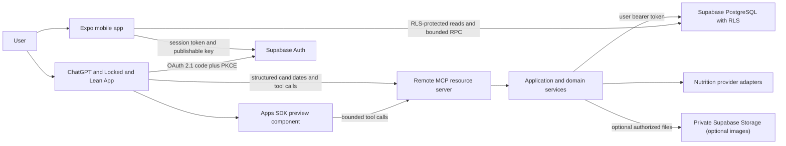
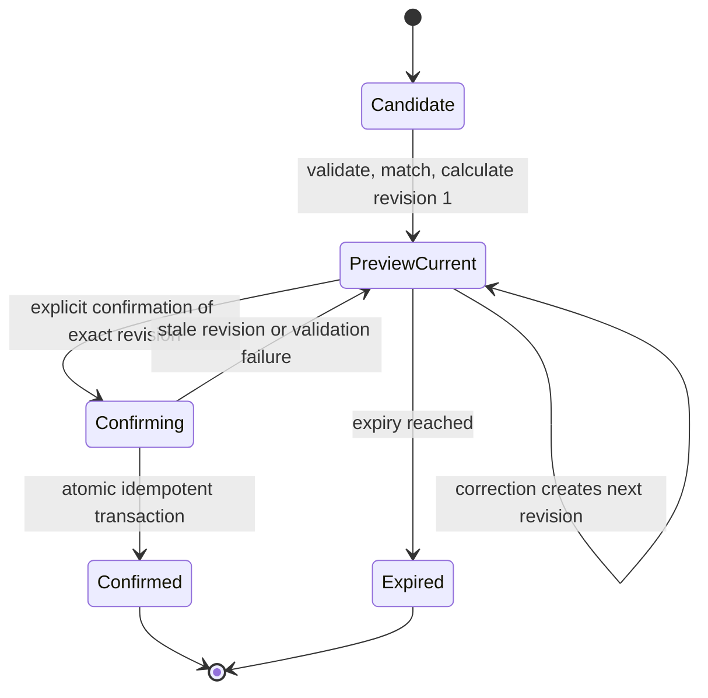

# Locked and Lean Architecture

Status: Planned architecture. No cloud integration is implied by this document.

Last compatibility review: 2026-07-12

## Purpose

Locked and Lean is a calorie, macro, body-weight, target, and history product for users in the Philippines. The product name is configuration, not a feature-level constant. The default locale context is the Philippines, the default timezone is `Asia/Manila`, the currency is PHP, and user-facing quantities use metric units plus qualified Filipino serving terms.

The governing state transition is:

> interpret first, verify second, log third

Every food source - ChatGPT, barcode lookup, saved food, or manual entry - must cross the same preview and confirmation boundary. A food candidate is not a diary record.

## Architecture invariants

1. ChatGPT performs food and photo interpretation. The Expo app, MCP server, Supabase functions, and nutrition adapters do not call an OpenAI model API.
2. The default ChatGPT image flow sends structured candidate data to MCP, not the raw image.
3. Preview and revision operations cannot create permanent food entries or affect daily summaries.
4. Confirmation names the exact current preview revision and uses an idempotency key.
5. The confirmation transaction recalculates item and entry totals from validated server-side values. It never trusts a client total or a supplied `user_id`.
6. Supabase RLS is the ownership boundary for every exposed user-data table. UI filtering and MCP tool selection are not authorization.
7. Historical food items snapshot the nutrition, provenance, confidence, uncertainty, market, and portion assumptions used when confirmed.
8. Estimates stay estimates. Unknown oil, sauce, recipe, serving weight, and market formulation remain explicit uncertainty.
9. `service_role` and secret provider credentials never enter the Expo bundle, Apps SDK component, tool result, or user-visible logs.
10. Mocks and fixtures are labeled as mocks and are never described as live providers.

## System context



### Expo mobile application

The Expo React Native application owns authentication UX, onboarding, Today, Calendar, Add, Progress, Profile, barcode capture, manual drafts, cached reads, and explicit preview-confirm UI. It uses a Supabase publishable key and the signed-in user's access token.

The application may read user-owned records through RLS. It must not directly insert food entries or entry items. Food mutations go through bounded RPC/application commands that enforce preview revision, confirmation, recomputation, and idempotency. Profile, target, and weight mutations also use server validation and derive ownership from the token.

The mobile app contains no general-purpose chat and no native AI photo interpretation. "Log with ChatGPT" explains and launches the external ChatGPT App workflow without depending on undocumented deep links.

### ChatGPT App and Apps SDK component

ChatGPT interprets a user's text or meal image into probable food candidates, visible portions, evidence, confidence, alternatives, and uncertainty. The Locked and Lean ChatGPT App exposes narrow MCP tools and, where useful, a sandboxed preview component backed by structured tool results.

The component is a presentation and interaction surface, not an authority. It receives no database credentials. Widget state and request metadata are untrusted. Tool results must not include access tokens, provider secrets, private signed URLs beyond their immediate authorized use, or hidden authorization data.

Apps SDK tool annotations describe impact accurately:

- pure reads and calculations with no stored state: `readOnlyHint: true`
- preview creation and revision: `readOnlyHint: false` because they persist temporary workflow state, even though they cannot write the diary
- confirmation, update, copy, and weight recording: `readOnlyHint: false`, `openWorldHint: false`
- deletion: `readOnlyHint: false`, `openWorldHint: false`, `destructiveHint: true`

Per-tool OAuth metadata is required, but it may advertise only scopes the authorization server actually issues. See [ADR-0001](DECISIONS/0001-supabase-oauth-custom-scopes.md).

### Remote MCP resource server

The MCP server is a stateless HTTPS resource server using the official MCP SDK and Apps SDK integration. It provides protected-resource metadata, structured tool schemas and results, token validation, request limits, safe audit events, and mapping from tool calls to application commands.

It does not interpret images, run an OpenAI model, own nutrition facts, or decide row ownership from tool arguments. It validates the token on every request, resolves the authenticated subject and OAuth `client_id`, applies application policy, then calls Supabase with the user's bearer token so RLS remains active.

MCP instances may keep transport/session state, but workflow state lives in PostgreSQL. Therefore an instance restart cannot erase a preview, duplicate a confirmed entry, or make a stale revision current.

### Application and domain services

The domain layer owns canonical schemas, unit normalization, aliases, Philippine-market ranking, provider comparison, uncertainty propagation, preview revision rules, server-side totals, target calculations, timezone conversion, and error mapping.

It is transport-neutral. MCP handlers, mobile RPC wrappers, scheduled repair jobs, and tests call the same commands rather than reimplementing food rules.

### Supabase

Supabase provides:

- Auth sessions for the first-party mobile app
- OAuth 2.1 authorization code flow with PKCE for ChatGPT/MCP
- asymmetric JWT signing keys and JWKS for distributed verification
- PostgreSQL as system of record
- RLS on every exposed user-data table
- private Storage only when an image workflow is explicitly authorized
- transactional database functions, constraints, indexes, and summary repair operations

Multi-table food confirmation uses a PostgreSQL transaction. Prefer a `SECURITY INVOKER` function callable only by the intended authenticated role. It accepts no owner ID, reads `auth.uid()`, checks the current token `client_id` where applicable, and is covered by RLS. If a narrowly scoped `SECURITY DEFINER` helper is ever unavoidable, it must live in a non-exposed schema, revoke default `PUBLIC` execute, set a safe `search_path`, re-check `auth.uid()`, and receive a separate security review.

The service-role key is reserved for operational jobs that cannot use a user context, such as a tightly scoped repair process. It is not on the normal mobile or MCP request path and must never be used to make an authorization failure disappear.

### Nutrition providers

Providers are replaceable read adapters behind a common contract. Initial candidates are private user-confirmed foods, exact Philippine label/manufacturer sources, official Philippine restaurant sources, legally usable Philippine composition data, Open Food Facts, USDA FoodData Central, and clearly marked comparable estimates.

Provider adapters return candidates and provenance; they do not write diary rows. Selection and conflict policy lives in the domain layer. Provider updates never rewrite confirmed history.

## Trust boundaries

| Boundary                      | Untrusted input                                                          | Required control                                                                      | Authority after control                        |
| ----------------------------- | ------------------------------------------------------------------------ | ------------------------------------------------------------------------------------- | ---------------------------------------------- |
| user to mobile                | form text, dates, quantity, barcode, confirmation tap                    | schema and range validation; server recomputation; exact revision                     | authenticated command only                     |
| ChatGPT to MCP                | interpreted candidates, descriptions, confidence, confirmation arguments | strict schema, limits, prompt-injection-safe handling, token verification, app policy | authenticated MCP request context              |
| Apps SDK component to MCP     | widget state and tool arguments                                          | treat as public client input; repeat all server checks                                | none until server validates                    |
| MCP to Supabase               | bearer token and command parameters                                      | verified JWT, user-token propagation, RLS, database constraints                       | `auth.uid()` plus policy-qualified `client_id` |
| mobile to Supabase            | publishable key, session token, filters                                  | RLS on every exposed table; bounded grants and RPC                                    | `auth.uid()`                                   |
| providers to domain           | matches, labels, nutrients, market metadata                              | timeout, schema, provenance, freshness, conflict handling                             | candidate data only                            |
| database transaction to diary | preview and selected nutrition                                           | current revision, unexpired state, recomputation, idempotency, constraints            | one historical entry                           |
| logs and telemetry            | identifiers and errors                                                   | allowlist fields, redact tokens and health details, minimize descriptions             | operational metadata only                      |

Neither `user_metadata`, client-supplied ownership, UI state, ChatGPT request hints, locale hints, nor a claimed product name can authorize access.

## Identity and authorization

### First-party mobile session

The mobile client signs in with Supabase Auth. Database requests carry the user access token. RLS policies require `(select auth.uid()) = user_id` for ownership and use both `USING` and `WITH CHECK` for updates. Direct sessions and OAuth client sessions have separate policies where their allowed operations differ.

### ChatGPT OAuth session

The remote MCP server publishes RFC 9728 protected-resource metadata and challenges unauthorized requests. ChatGPT discovers Supabase Auth, uses authorization code plus PKCE S256, and sends the resulting bearer token to MCP. The server verifies signature, exact issuer, expected audience/resource, time claims, subject, role, and approved `client_id` on every call.

As of 2026-07-12, Supabase OAuth access tokens support only `openid`, `email`, `profile`, and `phone` scopes. These scopes control OIDC identity output, not database or tool permissions. Custom scopes such as `food:write` are not currently supported. Locked and Lean therefore must not claim scope-based action authorization.

The honest interim control is:

1. advertise only supported standard scopes in OAuth and tool metadata
2. verify the exact issuer, resource audience, subject, expiry, and `client_id`
3. default-deny unknown OAuth clients
4. map approved `client_id` values to explicit application actions in server-owned policy
5. enforce the same client policy in RLS or policy functions as defense in depth
6. require row ownership through `auth.uid()` for every user-data operation
7. audit client, action, subject pseudonym, result, and idempotency outcome without storing tokens

This is suitable for controlled development and a restricted allowlisted rollout. It is not an honest replacement for user-consented application scopes. Production ChatGPT write release stays blocked until [ADR-0001](DECISIONS/0001-supabase-oauth-custom-scopes.md) exit criteria are met.

The OAuth token audience must be the canonical MCP resource identifier. A Supabase Custom Access Token Hook may set `aud` based on an approved `client_id`; the server must reject the default generic audience. The live discovery, protected-resource metadata, custom hook behavior, ChatGPT registration mode, redirect URI, and audience round trip must be contract-tested before deployment.

## Interpret, verify, log state machine



A preview stores owner, source, normalized items, item-level nutrition and provenance, complete totals, confidence, uncertainty, meal, consumed timestamp, timezone/local date, revision number, last presentation time, status, expiry, and confirmed entry ID. A correction produces a new complete current revision and clears any earlier confirmation intent.

Confirmation succeeds only when all of the following are true in one transaction:

- authenticated subject owns the preview
- OAuth client is approved for confirmation when the caller is OAuth
- preview is unexpired, unconfirmed, and current
- requested revision equals the current revision
- explicit confirmation is true and unambiguous
- item schemas, quantities, nutrient bounds, and source rules still pass
- totals are recomputed from the current items
- idempotency key is unused or maps to the identical prior request

The transaction creates the entry and item snapshots, recalculates the affected daily summary, marks the preview confirmed, records the entry ID and idempotency result, and commits once. Any failure rolls back all effects. A safe retry returns the original result.

## Data ownership and consistency

- `user_id` columns are assigned from authenticated database context, never a request body.
- Parent ownership alone is not enough: entry-item access proves ownership through a policy-safe parent relationship or repeated immutable owner key with constraints.
- Exposed views use `security_invoker = true` on supported PostgreSQL versions or are kept out of exposed schemas.
- Daily summaries are derived caches, not the source of truth. The rebuild operation recomputes from confirmed entries for the user and local date.
- `consumed_at` is a timestamp. Local date is derived server-side from the saved IANA timezone, never by truncating UTC. Historical rows keep the timezone context used at confirmation.
- Target changes and weight changes do not silently rewrite prior target versions or food history.
- Database constraints reject negative quantities and nutrients, impossible revisions, duplicate confirmation links, and invalid status transitions.

## Offline behavior

The mobile cache may show the most recently loaded Today and Calendar records offline with a visible "last updated" indicator. Manual drafts remain local and visibly unsynced. Cached records are not proof that a server write succeeded.

Food previews can be drafted offline but cannot be authoritatively matched, calculated, or confirmed offline. On reconnect, the client submits the draft, receives a fresh complete preview, and requires confirmation of that server revision. An offline edit to an existing food entry also requires a new server preview before it can replace history.

Network-interrupted confirmation is retried with the same idempotency key and exact revision. If the server reports expired, stale, or conflicting state, the app refreshes and presents a new preview. The client never silently discards input, silently replays a destructive action, or assumes success from a timeout.

Read cache, drafts, and pending request metadata must exclude access tokens and minimize health data. Authentication expiry while offline transitions to read-only cached mode until reauthentication.

## Failure behavior

| Failure                                       | User-visible behavior                                                                   | Server behavior                                     | Recovery                                                         |
| --------------------------------------------- | --------------------------------------------------------------------------------------- | --------------------------------------------------- | ---------------------------------------------------------------- |
| provider timeout or rate limit                | preview shows unavailable source and existing qualified alternatives; no invented match | time-box adapter, circuit break, record safe metric | retry or manual/user-confirmed nutrition                         |
| no Philippine-market match                    | show foreign-market warning or unknown product                                          | preserve source and market uncertainty              | label entry manually or choose another source                    |
| MCP unavailable                               | ChatGPT flow cannot preview or confirm                                                  | no database mutation                                | retry later; mobile remains usable for cached reads/manual draft |
| Supabase unavailable                          | keep draft and cached views                                                             | fail closed; no partial commit                      | bounded retry with same idempotency key                          |
| token invalid or expired                      | reconnect prompt                                                                        | return 401 and OAuth challenge; no tool work        | reauthorize                                                      |
| client not approved                           | clear unavailable-for-this-client error                                                 | return deny; do not use service role                | administrator policy review                                      |
| stale preview revision                        | show latest complete revision                                                           | reject conflict; no write                           | fetch latest, review, confirm again                              |
| preview expired                               | explain that nutrition must be refreshed                                                | reject; no write                                    | create new preview                                               |
| duplicate confirmation                        | show original success                                                                   | return stored identical result                      | none                                                             |
| idempotency key reused with different request | show conflict                                                                           | reject and audit                                    | start a new user action/key                                      |
| summary update fails                          | do not claim food logged                                                                | transaction rollback                                | retry; repair job only for independently detected drift          |
| response lost after commit                    | keep pending until reconciled                                                           | stored idempotent result remains available          | retry same key or fetch by operation ID                          |

## Provider replacement boundaries

Every nutrition adapter implements a versioned contract equivalent to:

```text
search(query, localeContext) -> ProviderCandidate[]
lookupBarcode(normalizedBarcode, marketContext) -> ProviderCandidate[]
getNutrition(providerId, servingContext) -> NutritionObservation
health() -> ProviderHealth
```

`NutritionObservation` includes source name, source record ID, source/version timestamp, market, serving description and measurable amount when known, calories/macros with nullability, attribution requirements, confidence, and warnings. Domain code converts observations into preview items. Adapter code cannot decide confirmation, ownership, daily date, or historical replacement.

Provider selection uses configuration and ordered policy rather than conditionals scattered through features. Removing a provider leaves confirmed history readable because snapshots contain the exact values and human-readable provenance used.

## Deployment topology

### Mobile

- Expo/EAS builds for iOS and Android
- environment-specific Supabase URL and publishable key only
- product name, locale defaults, and public MCP/App URLs injected through typed configuration
- no service-role, provider secret, or model API credential

### Supabase project

- managed Auth, OAuth 2.1, PostgreSQL, and optional private Storage
- separate development, staging, and production projects
- versioned migrations and RLS tests promoted through environments
- asymmetric signing keys for OAuth/OIDC and JWKS-based verification
- short-lived signed URLs only for explicitly authorized private files

### Remote MCP service

- public HTTPS endpoint with canonical resource identifier
- stateless TypeScript application using official MCP and Apps SDK packages
- health and readiness endpoints that reveal no secrets or user records
- horizontally scalable instances sharing workflow state only through PostgreSQL
- deploy first to the smallest runtime that passes streamable HTTP, OAuth discovery, timeouts, and MCP Inspector tests

Supabase Edge Functions are preferred when they satisfy the complete MCP transport and lifecycle contract. A small Vercel TypeScript service is the fallback when the Edge runtime cannot. Transport, token-verifier, provider, repository, and clock interfaces prevent the deployment choice from leaking into domain rules.

### Optional Apps SDK component assets

The preview component bundle is served from an immutable HTTPS asset origin with a narrow content security policy and a unique widget domain. It calls only the MCP tool surface, not Supabase directly.

## Observability and operations

Use correlation ID, tool name, hashed/pseudonymous subject, OAuth client ID, preview ID, revision, provider code, latency bucket, idempotency outcome, and error class. Never log access or refresh tokens, authorization headers, provider keys, full meal descriptions, ChatGPT transcripts, full health records, or meal images.

Alerts cover token verification failures, denied clients, provider failure rates, preview-to-confirm anomalies, stale revision conflicts, duplicate-write attempts, database latency, summary drift, and repair outcomes. Repair is an explicit, auditable recomputation, not a hidden overwrite.

## Acceptance criteria

Architecture implementation is acceptable only when tests prove:

1. no mobile or server dependency or source calls an OpenAI model API
2. image-based and text-based ChatGPT inputs create only previews
3. barcode and manual inputs use the same preview-confirm command boundary
4. a complete preview exposes assumptions, uncertainty, provenance, meal, time, and totals
5. correction increments revision and invalidates prior confirmation intent
6. old, expired, ambiguous, cross-user, wrong-client, wrong-audience, and unconfirmed requests create no diary row
7. explicit confirmation of the current revision creates exactly one entry and matching item snapshots
8. retrying the same confirmation returns the same entry; conflicting idempotency reuse fails
9. database tests prove User A cannot read or change User B data across all exposed records and files
10. direct mobile sessions and OAuth clients receive only their intended operations
11. provider changes do not alter historical entries
12. `Asia/Manila` and other IANA timezone boundary tests produce correct local dates without UTC truncation
13. offline drafts survive reconnect and cannot bypass a fresh server preview
14. a failed summary update rolls back confirmation, and repair detects and corrects induced drift
15. MCP Inspector validates protected-resource discovery, PKCE, token verification, per-tool auth metadata, and reconnect behavior
16. live OAuth tests confirm the token audience/resource and approved `client_id`; no test claims `food:*` scope enforcement while Supabase lacks custom application scopes

## Current compatibility sources

- [OpenAI Apps SDK authentication](https://developers.openai.com/apps-sdk/build/auth)
- [OpenAI Apps SDK tool design](https://developers.openai.com/apps-sdk/plan/tools)
- [Supabase OAuth 2.1 server](https://supabase.com/docs/guides/auth/oauth-server)
- [Supabase OAuth flows and available scopes](https://supabase.com/docs/guides/auth/oauth-server/oauth-flows)
- [Supabase MCP authentication](https://supabase.com/docs/guides/auth/oauth-server/mcp-authentication)
- [Supabase token security and RLS](https://supabase.com/docs/guides/auth/oauth-server/token-security)
