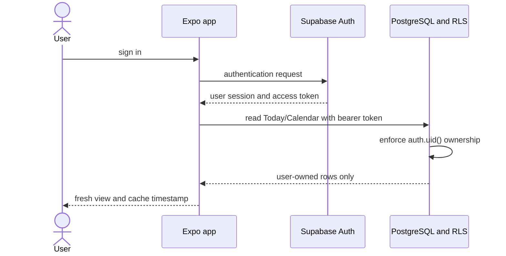
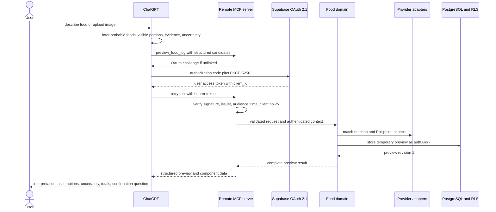
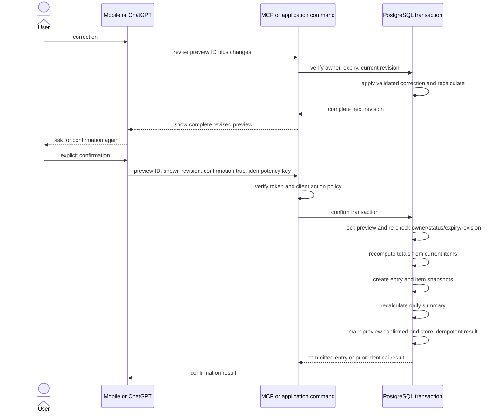
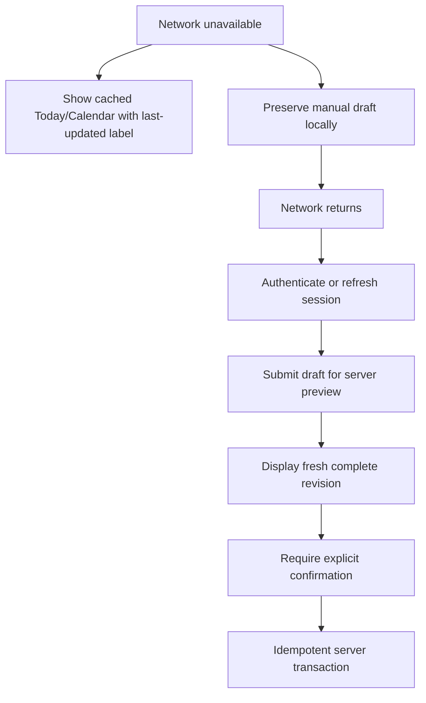

# Locked and Lean Data Flow

Status: Planned. Provider and cloud paths described here are not live integrations.

## Rules that apply to every flow

- Food interpretation produces candidates, never diary entries.
- Every food source produces a complete, server-calculated preview.
- Every correction produces a new revision and a new complete preview.
- Only explicit confirmation of the exact current revision can enter the confirmation transaction.
- The authenticated token supplies ownership. Request bodies never supply a trusted `user_id`.
- RLS remains active on user-context database requests.
- Permanent writes are transactional and idempotent.
- Confidence, uncertainty, provider, market, and serving assumptions travel with the data and are snapshotted at confirmation.
- Dates are resolved with the saved IANA timezone, default `Asia/Manila`, not by truncating UTC.

## Data classes

| Class                    | Examples                                                  | Storage                                        | Notes                                             |
| ------------------------ | --------------------------------------------------------- | ---------------------------------------------- | ------------------------------------------------- |
| identity                 | Supabase subject, session ID, OAuth client ID             | Supabase Auth; minimal policy/audit references | tokens are never logged                           |
| health and nutrition     | food entries, macros, body weight, targets                | RLS-protected PostgreSQL                       | user-owned and sensitive                          |
| temporary interpretation | candidates, evidence text, uncertainty, preview revisions | RLS-protected PostgreSQL with expiry           | not a diary record                                |
| source provenance        | provider name/ID/version, label, market warning           | preview then historical item snapshot          | supports audit and provider replacement           |
| optional image           | explicitly authorized meal or label image                 | private Storage                                | not present in default ChatGPT flow               |
| local cache and drafts   | cached Today/Calendar, unsynced manual draft              | device secure/local application storage        | visible offline status and minimum necessary data |
| operations               | correlation ID, error class, latency, idempotency outcome | restricted telemetry/audit                     | descriptions, tokens, and images excluded         |

## 1. Mobile sign-in and read flow



The publishable key identifies the Supabase project; it does not authorize rows. RLS owns access. The app caches the minimum view data needed for offline Today and Calendar screens. Logout and account-deletion flows clear local sensitive cache.

## 2. Manual, saved-food, and barcode preview flow

```mermaid
sequenceDiagram
    actor User
    participant App as Expo app
    participant Cmd as Application command
    participant Providers as Provider adapters
    participant DB as PostgreSQL and RLS

    User->>App: enter food or scan barcode
    App->>Cmd: candidate input, meal, time, timezone
    Cmd->>Cmd: validate ranges and normalize units/barcode
    Cmd->>DB: read private saved foods as user
    Cmd->>Providers: search qualified sources
    Providers-->>Cmd: candidates plus provenance and warnings
    Cmd->>Cmd: rank, calculate, preserve unknowns
    Cmd->>DB: store temporary preview revision 1
    DB-->>Cmd: preview ID and revision
    Cmd-->>App: complete preview, uncertainty, totals
    App-->>User: review; no diary change
```

Camera permission and scan debounce happen before lookup. Barcode prefix is not proof of Philippine market status. A foreign-market result carries a formulation/serving warning. An unknown product falls back to manual or private user-confirmed food, not an invented match.

## 3. ChatGPT text or image interpretation flow



The default MCP input contains structured interpretation, not raw image bytes. If an optional label-image flow is later approved, file acceptance is a separate capability with explicit authorization, file limits, private storage, short-lived access, and retention policy.

The OAuth consent metadata advertises only scopes Supabase actually supports. Until custom application scopes exist or an equivalent authorization design is approved, verified `client_id`, server application policy, RLS, and ownership enforce the controlled interim path. This limitation is described in [ADR-0001](DECISIONS/0001-supabase-oauth-custom-scopes.md).

## 4. Correction and exact-revision confirmation



Responses such as "maybe", "close enough", or an action without the exact revision are not confirmation. A material update to a confirmed entry uses a new preview/revision path rather than an unchecked update.

## 5. Mobile refresh after ChatGPT confirmation

The server commit is the synchronization point. The mobile app does not receive or trust a ChatGPT-generated total. It refetches confirmed entries and daily summary through RLS on app focus, user refresh, or a bounded cache invalidation signal. Realtime may be added as an optimization, not as the only consistency mechanism.

If the summary and entries disagree, the UI shows a retryable incomplete state and the server runs an auditable rebuild from confirmed entry snapshots. It does not patch totals from the client.

## 6. Offline and reconnect flow



There is no offline permanent food-entry queue. This avoids logging data that has not been matched, recalculated, and reviewed. A confirmation that timed out may be retried only with its original idempotency key and exact revision. The client reconciles the server result before showing success.

## 7. Provider lookup and replacement flow

1. Domain code sends a normalized query, barcode, serving context, and Philippine market context to configured adapters.
2. Each adapter returns schema-validated observations with source identity, version/freshness, serving basis, nutrient nullability, attribution, and warnings.
3. Domain policy ranks private confirmed data and exact Philippine sources ahead of generic or foreign fallbacks.
4. Conflicts and unavailable sources remain visible in the preview.
5. Confirmation snapshots the selected observation and assumptions into the entry item.
6. Later provider refreshes affect new previews only. Historical snapshots do not change.

Provider calls contain no Supabase access token and no more user context than the lookup requires. Provider API keys stay in server-only configuration.

## 8. Weight and target flow

Weight and target commands derive ownership from the authenticated token, validate metric ranges, and write through bounded server/database operations. A weight retry is idempotent. A target calculation stores formula name, version, inputs, activity multiplier, goal adjustment, macro assumptions, and effective date.

A weight change may produce a proposed target update, but it does not silently change the active target. Personalized MVP targets are restricted to adults 18 and older and remain informational, not medical advice.

## 9. Deletion, export, and account removal

Deletion requires current authentication, ownership, and a destructive tool annotation/confirmation in ChatGPT surfaces. Deleting an entry and recalculating its summary are one transaction. Retries are idempotent.

Account export reads only the authenticated user's RLS-protected data. Account deletion is a coordinated workflow that revokes sessions, prevents new writes, removes or anonymizes user-owned database and private-storage records according to the approved retention policy, and clears local cache. Operational audit retention must avoid reconstructing meal details.

## 10. Failure and data-integrity branches

| Condition                             | Data movement                                         | Permanent effect                                |
| ------------------------------------- | ----------------------------------------------------- | ----------------------------------------------- |
| invalid/expired token                 | request stops at MCP or Supabase                      | none                                            |
| wrong issuer/audience/client          | request stops before domain/database                  | none; safe audit event                          |
| cross-user preview ID                 | RLS/ownership check denies                            | none                                            |
| stale or expired revision             | latest metadata may be returned safely                | none                                            |
| provider outage                       | qualified cached/alternate candidate or error returns | preview only, if user can review it             |
| database timeout before commit        | client retains pending key                            | none or unknown until idempotent reconciliation |
| response loss after commit            | same request/key is retried                           | original entry returned, no duplicate           |
| daily-summary failure in confirmation | transaction rolls back                                | none                                            |
| later summary drift                   | rebuild reads confirmed entries                       | derived summary repaired; history unchanged     |

## Prohibited flows

- mobile, backend, or MCP to an OpenAI model API
- ChatGPT tool argument `user_id` to database ownership
- client-calculated totals to permanent entry totals
- Apps SDK component directly to Supabase tables
- service-role key to mobile, widget, ChatGPT, or ordinary MCP user requests
- provider response directly to a diary table
- preview creation or revision to food entries or daily summaries
- ambiguous confirmation to a permanent write
- raw image storage without explicit authorization
- access/refresh tokens, authorization headers, full health records, meal images, or ChatGPT transcripts to logs
