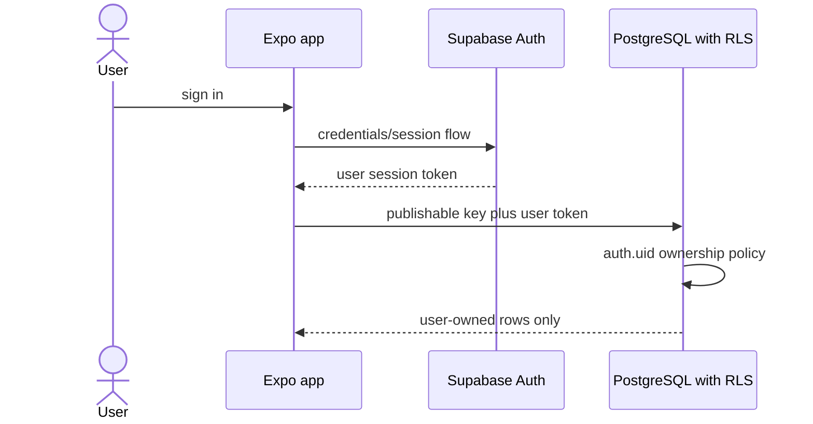
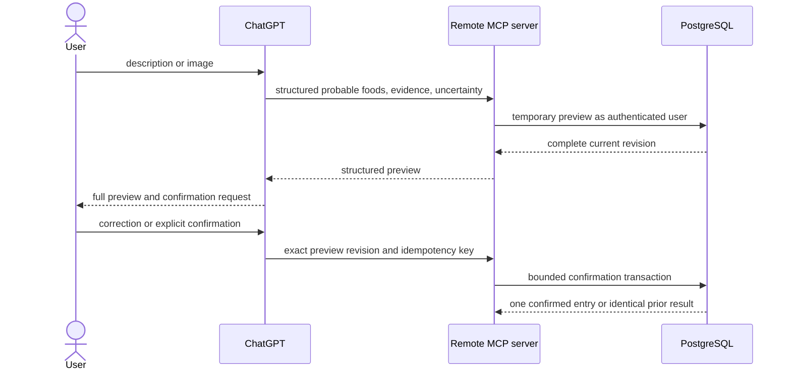

# Locked and Lean privacy data flow

Status: Phase 2 privacy design and implementation inventory. This is engineering documentation, not a privacy notice or legal opinion.

Last reviewed: 2026-07-13

## Privacy principles

- Collect only data needed for food logging, calorie/macros, body weight, targets, and history.
- Treat meal descriptions, images, weight, body measurements, targets, and nutrition history as sensitive health-related data.
- Derive ownership from the authenticated subject and enforce it in PostgreSQL RLS and Storage policies.
- Keep ChatGPT interpretation separate from confirmed history and preserve uncertainty.
- Do not send food/photo interpretation to an OpenAI model API from the app or backend.
- Do not place access tokens, refresh tokens, authorization headers, full meal images, ChatGPT transcripts, or full health records in logs.
- Define and implement retention, export, and deletion before production.

## Data inventory

| Data class                   | Examples                                                           | Purpose                                                                    | System of record                                           | Static Phase 2 control                                                              | Retention status                                    |
| ---------------------------- | ------------------------------------------------------------------ | -------------------------------------------------------------------------- | ---------------------------------------------------------- | ----------------------------------------------------------------------------------- | --------------------------------------------------- |
| account identity             | Supabase user ID, email in Auth                                    | sign-in and ownership                                                      | Supabase Auth                                              | token-derived `auth.uid()`                                                          | policy not yet approved                             |
| profile/body inputs          | display name, birth date, formula sex, height, timezone            | onboarding and target formula                                              | `profiles`                                                 | own-row RLS, database ranges                                                        | policy not yet approved                             |
| targets                      | calories/macros, weight input, formula/version, goal               | proposed/confirmed target history                                          | `nutrition_targets`                                        | own-row RLS, adult/range constraints                                                | policy not yet approved                             |
| food interpretation          | original description, image evidence text, candidates, uncertainty | produce a complete reviewable preview                                      | preview/revision/item tables                               | own-row RLS, revision and expiry fields                                             | expiry exists; purge not implemented                |
| confirmed food history       | item snapshots, macros, source, market, confidence, local date     | diary, Today, Calendar                                                     | `food_entries`, `food_entry_items`                         | own-row RLS, immutable snapshot design                                              | user-controlled history; deletion workflow pending  |
| saved/private food           | user-owned `food_products` and aliases                             | reuse private product facts                                                | catalog tables                                             | global rows use null owner; private rows own-only                                   | policy not yet approved                             |
| weight                       | timestamp, local date, kilograms                                   | progress and target context                                                | `weight_logs`                                              | own-row RLS and range constraints                                                   | policy not yet approved                             |
| daily derived data           | totals, target snapshot, weight                                    | fast Today/Calendar reads                                                  | `daily_summaries`                                          | own-row RLS; rebuild from owned source rows                                         | follows source data; policy pending                 |
| optional meal image          | private file and user/session path                                 | optional authorized scan/image workflow                                    | private `meal-images` bucket                               | private bucket, MIME/size/path policies                                             | cleanup/expiry not implemented                      |
| authorization/retry metadata | OAuth client ID, approved action, outcome, idempotency key/result  | default-deny sensitive actions, prevent duplicates, and investigate access | private client/action policy plus audit/idempotency tables | client/action policy ships empty; own-row RLS; narrow audit fields; no token fields | policy administration and retention not implemented |
| local mobile cache           | recent Today/Calendar, drafts, pending key                         | offline continuity                                                         | device storage                                             | architecture requires minimization and logout/delete clearing                       | implementation pending                              |
| operational telemetry        | safe error class, latency, correlation ID                          | reliability/security monitoring                                            | future observability system                                | allowlist requirement only                                                          | implementation/retention pending                    |

The profile and target schema records formula sex because the selected MVP formula uses it. Product and privacy copy must explain this limited purpose and avoid implying gender identity. Personalized targets are restricted to adults for the MVP.

## Primary flows

### Mobile read

The publishable key is public configuration. It is not a substitute for RLS. The app should cache only the fields needed for offline Today/Calendar and clear sensitive cache on logout and account deletion.

### Food interpretation, review, and confirmation

By default, the MCP server receives structured interpretation, not raw ChatGPT image bytes. User descriptions, label text, image evidence, and provider strings remain untrusted data and must never become tool instructions or authorization input.

The confirmation RPC requires a token-derived `client_id` with an enabled exact `confirm_food_log` policy row and denies missing or unknown clients. Local pgTAP passed the approved, missing, and unknown-client cases plus cross-user denial. This database control is defense in depth. No deployed MCP implementation yet proves JWT signature, exact issuer, canonical resource audience, time claims, session/revocation state, subject, role, and `client_id` for every request. Supabase's current standard OAuth scopes describe identity output rather than granular food/weight permissions, so general ChatGPT writes remain blocked under ADR-0001.

### Optional meal image

The migration creates a private `meal-images` bucket with a 10 MiB limit and JPEG/PNG/WebP allowlist. Object policies bind the first path segment to the authenticated user and an approved scan session. The intended path is `{user_id}/{session_id}/{random_filename}`.

Before production, the upload service must prove that it validates actual file bytes, type, decoded dimensions, and size; that names are server-randomized; that signed URLs are short-lived; and that account deletion and retention jobs remove objects. A client-asserted MIME type or dimension is not sufficient.

### Nutrition providers

Provider queries should contain a normalized food/barcode and only the market context needed for matching. Do not send Supabase tokens, full health history, unrelated identity data, or ChatGPT transcripts. Provider responses remain candidates until validation and user confirmation. Confirmed entries snapshot the selected provenance so later provider changes do not rewrite history.

### Logs and audit

Allowed audit content is limited to authenticated subject (or approved pseudonym), OAuth client ID, action, outcome, safe correlation ID, referenced record IDs, idempotency outcome, coarse error class, and timestamp.

Never log:

- access or refresh tokens, authorization headers, service-role keys, or provider keys
- full meal descriptions, label text, ChatGPT transcripts, or image evidence
- full meal images or signed URLs
- full weight, target, profile, or food-history records
- raw provider payloads when they contain user data

## Data sharing and processors

| Recipient/system                 | Data sent                                               | Status                                                                       |
| -------------------------------- | ------------------------------------------------------- | ---------------------------------------------------------------------------- |
| Supabase Auth/PostgreSQL/Storage | identity, owned health-related records, optional images | planned platform; live project verification pending                          |
| ChatGPT                          | user-provided description/image and returned preview    | user-facing interpretation boundary; Apps SDK/MCP not implemented in Phase 2 |
| nutrition providers              | minimal food/barcode and market query                   | adapters/fixtures only; live integrations pending                            |
| crash/observability vendor       | allowlisted operational metadata only                   | no vendor selected/implemented                                               |

No provider may receive the user's Supabase bearer token. No backend or mobile component may call an OpenAI model API.

## Retention schedule requiring approval

The database currently has expiry timestamps for previews and scan sessions but no purge job. The following schedule must be set by product, privacy/legal, and operations before production:

| Data                                 | Proposed engineering posture                                                     | Implementation status               |
| ------------------------------------ | -------------------------------------------------------------------------------- | ----------------------------------- |
| draft/expired previews and items     | short-lived; purge shortly after expiry unless needed for an active support case | not implemented                     |
| scan sessions and unused images      | short-lived; purge expired sessions and unlinked objects                         | not implemented                     |
| confirmed food/weight/target history | retain while account is active or until user deletes applicable record           | record deletion UX/workflow pending |
| idempotency records                  | retain only through the safe retry/reconciliation window                         | not implemented                     |
| OAuth action audit                   | minimal bounded security retention; no meal content                              | not implemented                     |
| device cache/drafts                  | minimal and cleared on logout/account deletion; drafts user-controllable         | implementation pending              |
| backups                              | time-bounded deletion propagation documented in privacy notice                   | deployment policy pending           |

Expiry without deletion is not a retention control. A scheduled job must delete or irreversibly minimize expired data and report failures without logging health contents.

## Export and account deletion

### Export requirements

An authenticated export must include only the requester's profile, target versions, saved foods, previews if still retained, confirmed entries/items, weight logs, daily summaries or a reproducible explanation, and relevant user-visible action history. Optional images should be included or enumerated with short-lived links. The export must not include provider secrets, internal policy data, other users, or service-role-only telemetry.

No export implementation exists. Local pgTAP passed cross-user isolation checks for current tables and confirmation, but those assertions exercise database reads/RPC behavior, not export composition, image enumeration, authorization, or delivery. They are not export-flow evidence.

### Deletion requirements

A coordinated account deletion must:

1. require recent authentication and explicit confirmation;
2. revoke/sign out sessions before destructive cleanup because deleting a user does not by itself make already-issued tokens harmless immediately;
3. block new writes while deletion is in progress;
4. delete the user's private Storage prefix and any orphaned objects;
5. delete/anonymize database records according to the approved audit and legal-retention policy;
6. delete the Auth user only after prerequisite cleanup can be reconciled safely;
7. clear mobile cache, local drafts, pending idempotency metadata, and downloaded images;
8. record only a minimal non-health deletion result and retry failures idempotently;
9. disclose backup deletion timing.

Database foreign keys currently cascade most user-owned rows when `auth.users` is deleted. Storage objects are not covered by those cascades, so deleting only the Auth row can orphan meal images. This is a production privacy blocker.

## User controls and notices

- Clearly distinguish estimates from measured or label-derived values.
- Explain photo uncertainty and that hidden oil, sugar, sauce, ingredients, and exact weight cannot be known from an image.
- Explain why camera/image access is requested and make optional image storage opt-in.
- Provide logout, record deletion, export, and account deletion instructions.
- State that Locked and Lean is informational and is not a medical device.
- Avoid moral labels such as good/bad, clean/dirty, cheat, or failure.
- Obtain legal/privacy review for the Philippines, app stores, children/age handling, processor terms, cross-border transfers, retention, and incident notices.

## Verification checklist

- Export as User A and prove no User B identifiers or records appear.
- Attempt export with anon, expired, wrong-audience, unapproved-client, and User B tokens.
- Delete an account populated with every table type and multiple images; query with service role afterward for leftovers.
- Revoke sessions and prove old access tokens cannot continue sensitive operations under the approved design.
- Run the retention job over expired previews, scans, images, idempotency rows, and audits; prove active records remain.
- Inspect mobile storage after logout and deletion.
- Search logs, crash reports, and traces for seeded canary tokens, descriptions, image URLs, weight, and targets.
- Verify provider requests contain only documented minimum fields.

## Current evidence boundary

Local Supabase zero-state reset applied the Phase 2 migration cleanly. The schema and confirmation pgTAP suites passed 66/66 assertions: 32 schema/security and 34 confirmation/RLS/idempotency/history checks. Database lint reported no schema errors, and local security/performance advisors reported no issues. The first live run exposed a cross-user foreign-key error before the stable authorization response and an ineffective schema-scoped default function ACL; both were fixed, and the final full rerun passed.

These results strengthen local database privacy evidence for own-row reads, cross-user confirmation denial, default-deny clients, exact-revision logging, minimal success/reuse audit, and privilege shape. They do not close export/deletion, Storage byte/`owner_id`/cleanup, hosted-project drift, runtime MCP token validation, device-cache erasure, retention, true concurrency, or forced-rollback evidence.

## References

- [Threat model](THREAT_MODEL.md)
- [Security review](SECURITY_REVIEW.md)
- [Architecture](ARCHITECTURE.md)
- [AI estimation limitations](AI_ESTIMATION_LIMITATIONS.md)
- [Supabase Storage private buckets](https://supabase.com/docs/guides/storage/buckets/fundamentals)
- [Supabase Storage ownership](https://supabase.com/docs/guides/storage/security/ownership)
