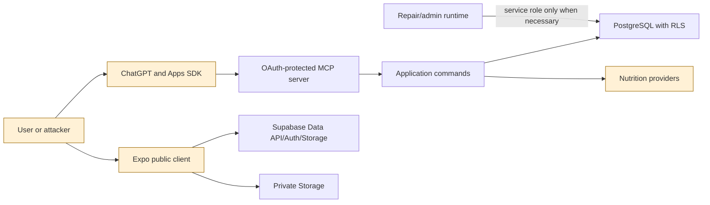

# Locked and Lean threat model

Status: Phase 2 security model. Local database controls passed zero-state migration, pgTAP, lint, and advisor checks; hosted and runtime controls remain separately unverified.

Last reviewed: 2026-07-13

## Security objectives

1. A user can access only their own profile, targets, private foods, previews, entries, weight, summaries, images, idempotency records, and action audits.
2. No food becomes permanent without a complete, current preview and explicit confirmation of that exact revision.
3. Ownership comes from the authenticated token, never a tool or client `user_id`.
4. Permanent nutrition totals are computed inside a trusted transaction from stored current-revision items, not accepted from the client.
5. A retry creates at most one entry and a reused idempotency key cannot authorize different input.
6. Meal, weight, target, image, and identity data are minimized, private, and removable through a verified account workflow.
7. ChatGPT performs interpretation; the mobile app, MCP server, and backend do not call OpenAI model APIs.

## Assets and sensitivity

| Asset                        | Examples                                                                   | Sensitivity | Primary control                                         |
| ---------------------------- | -------------------------------------------------------------------------- | ----------- | ------------------------------------------------------- |
| identity and profile         | auth subject, display name, birth date, formula sex, height                | high        | Supabase Auth, RLS, minimization                        |
| nutrition and health records | entries, macros, weight, targets, local dates                              | high        | RLS, bounded RPC, encryption in transit/at rest         |
| temporary interpretation     | original description, image evidence description, candidates, uncertainty  | high        | short retention, ownership, no instruction execution    |
| meal images                  | optional private image objects                                             | high        | private bucket, Storage RLS, short-lived URLs, deletion |
| authorization material       | access/refresh tokens, service-role key, provider keys                     | critical    | server-only storage, redaction, rotation                |
| integrity state              | preview revision, presentation time, idempotency key, confirmed entry link | high        | database constraints, locks, one transaction            |
| nutrition provenance         | provider ID/version, market, attribution, estimate/confidence              | medium      | immutable confirmed snapshot                            |
| operational evidence         | safe action audit, failure class, correlation ID                           | medium      | allowlisted fields, bounded retention                   |

## Actors and assumptions

- An unauthenticated internet client can call public mobile, MCP, and Supabase endpoints.
- An authenticated user may deliberately tamper with IDs, totals, dates, revisions, file paths, and retry order.
- A third-party OAuth client may hold a valid user token but lack permission for a particular application action.
- ChatGPT output, nutrition-label text, provider data, barcodes, filenames, and user descriptions are untrusted data.
- Nutrition providers may be wrong, stale, unavailable, or compromised.
- A service-role credential, database owner, or privileged operator bypasses RLS; operational access is therefore a separate trust boundary.
- Supabase project settings can diverge from migrations. Exposed schemas, function privileges, Auth claims, bucket settings, and live grants require deployment verification.

## Trust boundaries



The publishable key identifies the project but does not authorize rows. The Apps SDK component, tool arguments, UI filters, `user_metadata`, and any claimed `user_id` are never authorization evidence.

## Threats and required controls

| ID   | Threat and abuse case                                                                       | Required control                                                                                                                                                      | Phase 2 evidence/status                                                                                                                                                                                                                                                                                                                       |
| ---- | ------------------------------------------------------------------------------------------- | --------------------------------------------------------------------------------------------------------------------------------------------------------------------- | --------------------------------------------------------------------------------------------------------------------------------------------------------------------------------------------------------------------------------------------------------------------------------------------------------------------------------------------- |
| T-01 | User B supplies User A's row or preview ID (BOLA/IDOR).                                     | `(select auth.uid()) = user_id` RLS; composite owner foreign keys; owner check inside privileged functions; User A/User B tests.                                      | Local pgTAP passed cross-user reads across owned tables and a stable `preview not found` denial for cross-user confirmation. The first run exposed foreign-key error ordering before the ownership response; the helper now checks ownership before idempotency insertion, and the final rerun passed. Hosted drift remains unverified.       |
| T-02 | Client supplies another `user_id`.                                                          | RPC schemas omit owner; database derives `auth.uid()`; reject owner claims at transport.                                                                              | `confirm_food_log` has no `user_id` parameter and derives `auth.uid()`. Preview/profile/target/weight commands are not yet implemented.                                                                                                                                                                                                       |
| T-03 | Client submits favorable calorie or macro totals.                                           | Accept item facts only through a validated preview path; recompute current item and entry totals in the transaction.                                                  | Local pgTAP passed recomputation from stored current-revision items rather than presented totals, trigger-maintained entry totals, and matching summary updates. Trusted preview creation remains unimplemented.                                                                                                                              |
| T-04 | Old or unseen revision is confirmed.                                                        | Lock preview; require ready/unexpired/current revision; require matching presentation evidence.                                                                       | Local pgTAP passed stale-revision and false-confirmation denial. Source also checks ready, expiry, `last_presented_at`, and matching revision `presented_at`; expired/unpresented and concurrent revision races still need dedicated execution.                                                                                               |
| T-05 | Network retry creates duplicate entries or key is replayed with changed input.              | Unique per-user operation/key, row lock, request binding, existing-result return, unique preview-to-entry link.                                                       | Local sequential pgTAP passed identical reuse, conflicting reuse, one-entry result, and `created`/`reused` audits. True concurrent same/different-key races, response loss, and forced rollback remain pending.                                                                                                                               |
| T-06 | OAuth token performs an action not consented/allowed.                                       | Verify issuer/audience/expiry/client at MCP; enforce a server-owned client/action policy at the database; enforce granular scopes only when the issuer supports them. | Confirmation now default-denies missing, unknown, disabled, or wrong-action clients through the empty-by-default private policy table. MCP signature/issuer/audience/time/session validation is not implemented, and standard Supabase scopes still do not express food/weight permission. General ChatGPT writes remain blocked by ADR-0001. |
| T-07 | `SECURITY DEFINER` bypasses ownership or resolves attacker-controlled objects.              | Non-exposed schema, empty/safe `search_path`, qualified relations, explicit `auth.uid()` check, narrow execute ACL.                                                   | Local pgTAP passed definer placement/search paths, reviewed execute ACLs, internal-helper denial, and the role-global future-function default revoke. The first run proved schema-scoped default revocation ineffective; the final role-global fix and assertion passed. Hosted ACL/exposed-schema drift remains unverified.                  |
| T-08 | RLS permits ownership reassignment on UPDATE.                                               | Both `USING` and `WITH CHECK`; supporting SELECT policy; immutable owner where possible.                                                                              | Authenticated roles currently have SELECT only, so no UPDATE policy applies. Any future write policy must add both clauses and tests.                                                                                                                                                                                                         |
| T-09 | Image is public, cross-user readable, oversized, spoofed, or retained after deletion.       | Private bucket; bucket/type/size restrictions; owner/path policy; trusted byte decoding/dimension checks; random name; cleanup.                                       | Local schema pgTAP passed the private-bucket and four-policy catalog assertions. Byte-level validation, actual Storage operations, `owner_id` binding, signed URLs, deletion, and cleanup remain pending.                                                                                                                                     |
| T-10 | Nutrition label, description, provider string, or image evidence contains prompt injection. | Treat as inert data; strict schema/size limits; never concatenate into instructions/SQL; encode UI; suppress from logs; no automatic tool action.                     | Zod and several SQL length/range checks exist. JSON/evidence bounds, rendering, MCP composition, and adversarial tests remain pending.                                                                                                                                                                                                        |
| T-11 | Service-role key leaks or is used for ordinary user requests.                               | Never expose to Expo/widget/tool results; user bearer token on ordinary path; inventory and monitor privileged jobs.                                                  | Environment template separates server-only key and prohibited-API scan passes. No deployed runtime or secret scan evidence yet.                                                                                                                                                                                                               |
| T-12 | Logs expose tokens, transcripts, images, or detailed health data.                           | Allowlist audit fields; redact authorization material; never log full descriptions/images/health records; retention.                                                  | Database audit table is metadata-only. MCP/observability implementation and retention are pending.                                                                                                                                                                                                                                            |
| T-13 | Valid user abuses expensive tools or storage.                                               | Per-user/client/IP limits, bounded arrays/files/ranges, timeouts, quotas, idempotency.                                                                                | Input arrays and summary rebuild range are bounded; MCP rate limiting and repeated-RPC abuse tests are pending.                                                                                                                                                                                                                               |
| T-14 | Account deletion removes Auth but leaves private images or caches.                          | Revoke sessions, block writes, delete Storage prefix and database rows, clear caches, verify completion, retain only approved minimal audit.                          | Database rows cascade from `auth.users`; end-to-end deletion/export and Storage cleanup are not implemented.                                                                                                                                                                                                                                  |
| T-15 | Vulnerable dependency or compromised provider changes behavior.                             | Pin versions and lockfile; audit; provenance validation; provider timeouts and schema validation.                                                                     | Versions and lockfile are present. Current npm audit reports moderate advisories; live provider adapters are not integrated.                                                                                                                                                                                                                  |

## Confirmation security invariant

A permanent entry is valid only if one transaction proves:

```text
authenticated owner
AND allowed caller/client action
AND preview.status = ready
AND preview.expires_at > now
AND requested revision = current revision
AND current revision was fully presented
AND confirmation = true
AND at least one validated current item
AND server recomputed totals
AND idempotency key is new for this request or maps to the identical result
```

Any failure must roll back entry rows, item rows, summaries, preview state, audit state that claims success, and the idempotency result.

## Abuse-focused verification matrix

- Run requests as `anon`, User A, User B, approved OAuth client, unapproved OAuth client, and service role.
- Exercise SELECT/INSERT/UPDATE/DELETE/RPC for every exposed table/function and Storage operation.
- Test ownership reassignment on every future UPDATE path with both old-row and new-row owner mismatches.
- Confirm a stale, expired, unpresented, cross-user, empty, negative, oversized, and malformed preview.
- Race two confirmations with the same key, two keys, and response loss after commit.
- Reuse one idempotency key with a different preview, revision, and confirmation value.
- Upload mismatched MIME/bytes, polyglots, decompression bombs, excessive dimensions, traversal-like names, overwrite attempts, and cross-user paths.
- Store prompt-injection strings in descriptions, labels, uncertainty, and provider fields; prove they render as data and cannot select or invoke tools.
- Delete an account containing every data type and images; prove export completeness, session revocation, storage removal, cache clearing, and approved audit retention.

## Accepted limitations and blockers

- Custom food/weight OAuth scopes are not supported by the current Supabase design documented in ADR-0001. General ChatGPT write release remains blocked.
- No deployed MCP verifier proves JWT signature, exact issuer, canonical resource audience, validity window, session/revocation state, role, subject, or approved `client_id` on every request. Database client/action checks are defense in depth, not a substitute.
- The master brief's raw-image path is optional. No raw ChatGPT image should reach Storage without a separately approved authorization and retention design.
- Local Supabase zero-state reset applied the migration cleanly; pgTAP passed 66/66 assertions (32 schema/security and 34 confirmation/RLS/idempotency/history); database lint reported no schema errors; and local security/performance advisors reported no issues.
- Those local results do not prove true concurrent confirmation, forced rollback/response-loss recovery, adversarial Storage behavior, hosted-project ACL/exposed-schema drift, or production JWT claims.
- Account export/deletion, Storage-prefix cleanup, byte-level upload inspection, and approved purge/retention jobs are absent and block the affected production features.

## References

- [Architecture](ARCHITECTURE.md)
- [Data flow](DATA_FLOW.md)
- [ADR-0001: OAuth custom scopes](DECISIONS/0001-supabase-oauth-custom-scopes.md)
- [ADR-0002: exact-revision gate](DECISIONS/0002-preview-revision-confirmation-gate.md)
- [Supabase Row Level Security](https://supabase.com/docs/guides/database/postgres/row-level-security)
- [Supabase database function security and privileges](https://supabase.com/docs/guides/database/functions)
- [Supabase Storage access control](https://supabase.com/docs/guides/storage/security/access-control)
- [Supabase Storage ownership](https://supabase.com/docs/guides/storage/security/ownership)
